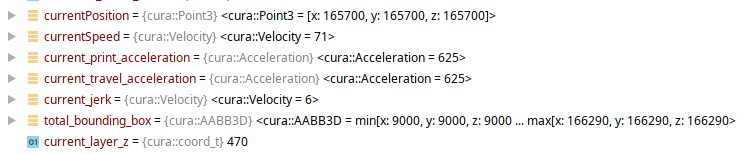
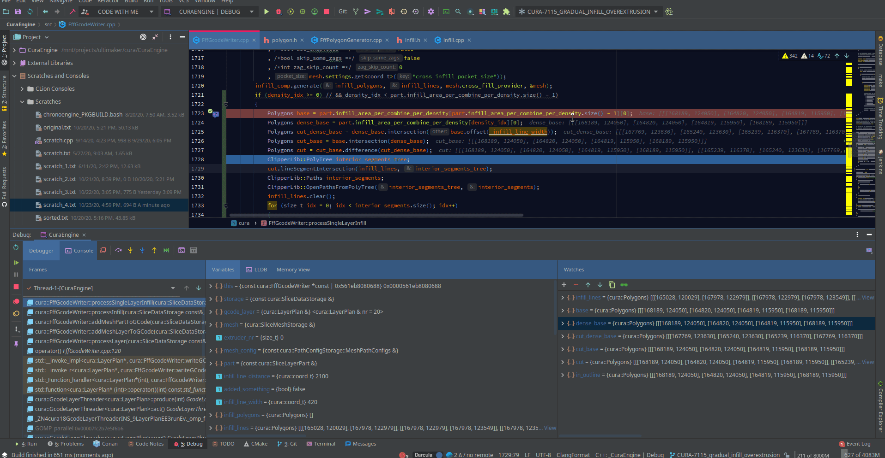

# curaengine-lldb-debug
LLDB debugging tools (such as pretty printers) for CuraEngine



Also easy Polygon viewing possible. If you have tool like [Klipper](https://userbase.kde.org/Klipper) it is possible to
set actions for certain cut snippets that match a regex pattern.
Create the following regular expression to match against `((^.+\s=)|(\s\[.+$))` and add
an action with the output handling flag `Ignore` set, containing the following Command
`echo %s | python <directory_containing>/debug_poly.py`
This is currently only tested on Linux running KDE with Clion. make sure you have numpy and
matplotlib installed.



## Currently implemented
 - [x] cura::Polygons
 - [x] cura::Temperature
 - [x] cura::Velocity
 - [x] cura::Acceleration
 - [x] cura::LayerIndex
 - [x] cura::Ratio
 - [x] cura::AngleDegrees
 - [x] cura::Point3
 - [x] cura::Point
 - [x] cura::AABB3D
 - [x] cura::ExtruderTrain
 - [x] cura::LayerPlan (partially implemented)
 
  # Instructions
 
 Add the following to your ``~/.ldbinit``
 ```txt
settings set target.load-cwd-lldbinit true
```
Create a `.ldbinit` file in the root of your **CuraEngine** directory containing the following:
```text
command script import <path to your curaengine-lldb-debug repo>/curaengine.py
```

# Usefull sources:

online:
- https://lldb.llvm.org/use/variable.html
- https://lldb.llvm.org/python_reference/index.html
- https://github.com/llvm/llvm-project/tree/master/lldb/examples
- https://github.com/fantaosha/LLDB-Eigen-Pretty-Printer/blob/master/LLDB_Eigen_Pretty_Printer.py
- https://github.com/qt-creator/qt-creator/tree/master/share/qtcreator/debugger

local:
 - /opt/clion/bin/lldb/renderers/lldb_formatters
